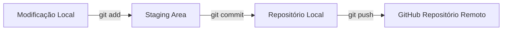

# 🐙 Guia de Git & Boas Práticas no GitHub

Este guia resume os comandos principais do Git e o padrão de mensagens de commit utilizado no curso.

---

## 📌 Fluxo Básico de Trabalho (Workflow)



### Comandos Essenciais

1. **Verificar o status dos arquivos**:
   ```bash
   git status
   ```

2. **Adicionar alterações para staging**:
   ```bash
   git add .
   ```

3. **Criar um commit com mensagem explicativa**:
   ```bash
   git commit -m "tipo: descrição curta do que foi feito"
   ```

4. **Enviar commits para o GitHub**:
   ```bash
   git push origin main
   ```

---

## 🏷️ Commits Semânticos (Conventional Commits)

No curso, encorajamos o uso do padrão de commits semânticos para manter o histórico organizado:

| Tipo | Descrição | Exemplo |
| :--- | :--- | :--- |
| `feat` | Uma nova funcionalidade | `git commit -m "feat: adiciona formulario de cadastro"` |
| `fix` | Correção de um bug | `git commit -m "fix: corrige erro no calculo de total"` |
| `docs` | Alterações na documentação | `git commit -m "docs: atualiza instrucoes no README"` |
| `style` | Formatação de código, CSS, sem alterar regra de negócio | `git commit -m "style: ajusta espaçamento dos botoes"` |
| `refactor` | Refatoração de código sem mudar comportamento | `git commit -m "refactor: simplifica funcao de validação"` |

---

## 🌿 Trabalhando com Branches (Ramos)

Para evitar alterar a branch principal (`main`) diretamente em funcionalidades em desenvolvimento:

```bash
# Criar e mudar para uma nova branch
git checkout -b feature/minha-nova-tela

# Enviar a nova branch para o GitHub
git push -u origin feature/minha-nova-tela
```
